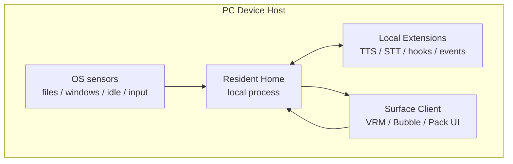
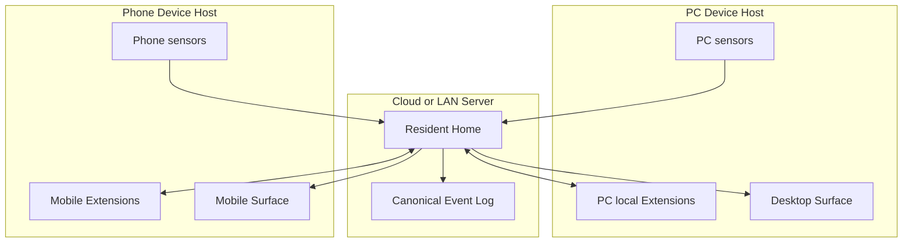
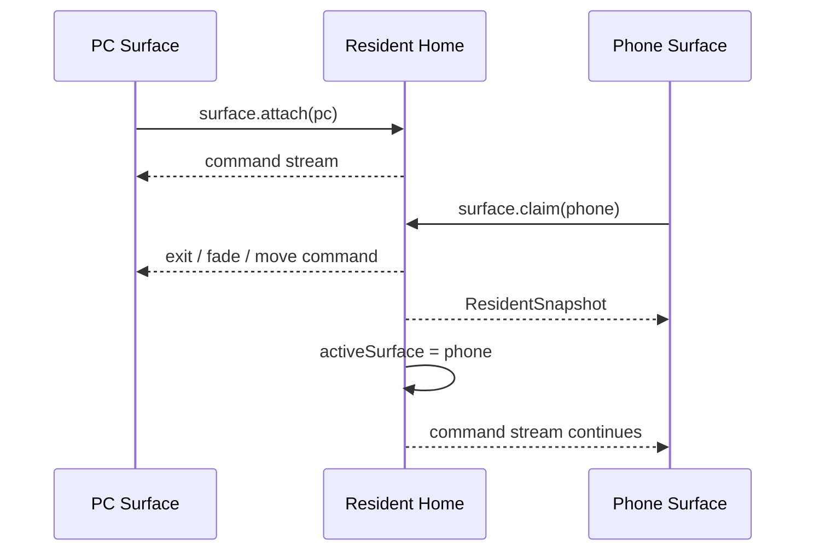

# Architecture: Resident Mesh

Yuukeiは、単一のデスクトップアプリではなく、Resident Homeを中心にしたResident Meshとして設計する。Resident Homeはローカルでもクラウドでも動ける。PCやスマホは、その住人の身体、感覚器、Extension実行場所になる。

## Components

### Resident Home

住人の継続性を持つ中核。ローカル常駐サーバーとしても、クラウド上のサービスとしても動ける。

責務:

- active World Packを読み、住人、台本、信号、権限を解釈する。
- Daihon Hostを呼び、決定的な生活イベントを実行する。
- canonical event logを保存する。
- 現在の住人状態、Surface状態、短期状態を管理する。
- Extensionがmanifestで提供するcapabilityを内部`CapabilityRouter`へ登録し、LLM、TTS、STT、記憶エンジンなどを呼ぶ。
- Extensionの登録、順序、権限、hook結果、event提案、signal alias寄贈を管理する。
- Surface Clientへsnapshotとcommand streamを配信する。

持たない責務:

- 特定LLMの実装。
- 特定の長期記憶DBやembedding方式。
- Tauri window操作。
- PCやスマホのOS API直接呼び出し。
- VRMやLive2Dの描画実装。

### Device Host

端末ごとに動くローカルホスト。PC、スマホ、将来の専用端末ごとに存在する。

責務:

- OS観測、ユーザー操作、端末状態をRuntimeEventとしてResident Homeへ送る。
- ローカルExtensionをインストール、起動、登録する。
- Surface Clientを起動・管理する。
- ローカル権限、OS権限、端末固有の安全境界を扱う。
- Resident Homeがクラウドにある場合、ローカル能力を安全に中継する。

Device Hostは人格や長期記憶を所有しない。端末が変わっても住人は同じであり続ける。

ユーザーがWorld Packディレクトリを選ぶ設定UIはDevice Hostに置いてよい。Device Hostはローカルファイルダイアログ、OS権限、選択パスの保存を扱う。ただし、active World Packの解釈、residentId、event logの分離、住人の継続性はResident Home側の起動設定として扱い、Surface Clientへ人格状態を持たせない。

Device Hostは、定期的なひとりごとのきっかけとして `presence.talk_impulse` を発行できる。おしゃべりの間隔は分単位のアプリ本体設定として `YUUKEI_DATA_DIR/settings/app.json` に保存し、既定は5分、0分で無効にする。実際の発火間隔は機械的になりすぎないよう設定値の前後に小さく揺らし、直近の会話や住人へのジェスチャーの直後はその回を見送る。

住人の表示倍率もアプリ本体設定として `settings/app.json` に保存する。値は50〜200%の倍率(既定100%)で、全住人共通の1値とする(住人ごとの個別倍率は将来候補)。Surfaceのactorウィンドウは基準サイズ(420×560 logical px)に倍率を掛けたサイズで生成し、縦横比は変えない。設定変更は再起動なしで全actorウィンドウへ反映し、足元(下辺中央)を基準に伸縮する。perch中の住人はリサイズ後にperch位置を再計算し、バルーン配置や衝突回避も倍率適用後のサイズで計算する。

セリフの吹き出しも舞台の整合性の一部としてDevice Hostが管理する。表示は住人ごとに同時に1個までとし、同一シーン内の連続セリフは読み時間ベースで順送り、別イベントのセリフが来たら残りを破棄して置き換える(表示ルールの詳細は03)。音声再生は後勝ち1本のままだが、`audio.play` の再生開始時に対応する吹き出しの寿命を音声の実長+余韻まで延長し、文字は音声再生に合わせて逐次表示する(逐次表示ルールの詳細は03。音声キューの完全同期は将来候補)。

住人の画面上の位置は、actorごとの足元anchor(下辺中央、logical px)として `YUUKEI_DATA_DIR/settings/stage.json` に永続化する。保存のタイミングはユーザーのドラッグ確定時、表示倍率の変更時、自発歩行(`stage.walk`、03参照)の終了時。起動時は保存位置を現在のモニタ構成へ正規化(モニタ内クランプ・衝突回避)して復元し、保存がないactorは従来の自動配置を使う。perch(ウィンドウ枠への座り)は地形が揮発なので永続化しない。位置はユーザーの操作結果であって観測ではないため、event logには流さずstage状態としてのみ持つ。

### Surface Client

住人の身体と演出を担当する表示クライアント。

責務:

- ResidentSnapshotを受け取って現在状態を復元する。
- RuntimeCommandを受け取って、表情、動作、発話、位置、UI演出を表示する。
- ユーザーのジェスチャー、ドラッグ、会話入力をDevice HostまたはResident Homeへ送る。
- VRM、Live2D、2Dアニメーション、モバイルウィジェットなどの描画方式を実装する。

Surface Clientは、人格、記憶、Daihon実行、Capability選択を所有しない。

### Extension

ユーザーまたは開発者が追加する交換可能な拡張単位。ローカルプロセス、将来の軽量runtime、クラウドAPI、専用ハードウェア、別端末上のサービスのどれでもよい。外部開発者向け概念はExtensionだけであり、能力提供、message変換、event購読、event発行、Daihon signal alias寄贈をmanifestの連続的な権限宣言で表す。

例:

- `dialogue.generate`: LLM応答生成。
- `speech.synthesis`: TTS。
- `speech.recognition`: STT。
- `memory.index`: event logから独自記憶DBを構築。
- `memory.retrieve`: 現在文脈に必要な記憶を検索。
- `embedding.generate`: embedding生成。
- `vision.observe`: 画像・カメラ文脈の認識。
- `beforeCommandEmit`: `dialogue.say` などの `RuntimeCommand` をSurfaceへ送る直前に変換する。
- `onEventAppended`: event logへ保存された出来事を観測し、必要なら新しい `RuntimeEvent` を提案する。
- `signalAliases`: Daihon作者向けに `活動時間_開始` のような別名を寄贈する。

Extensionは、Coreの所有者ではない。複数Extensionが同じcapabilityを提供でき、Resident Homeが選択・許可・呼び出しを管理する。CapabilityRouterは内部機構として残り、`speech.synthesis` や `dialogue.generate` などの名前付きcapabilityを選択したExtensionへルーティングする。

ExtensionはCore内部オブジェクト、Surface実装、event logファイルを直接変更しない。入力として公開protocol messageのコピーを受け取り、変更案やevent提案をResident Homeへ返す。Resident Homeは結果を検証し、採用した変換または正規化したeventをcanonical event logへ記録してから次の境界へ流す。

ローカルExtensionは、World Packとは違い、設定画面で選ばれたフォルダをDevice Host管理下の `YUUKEI_DATA_DIR/extensions/<extensionId>/` へコピーしてインストールする。ユーザーが選んだ有効/無効状態とhook pointごとの実行順は `YUUKEI_DATA_DIR/settings/extensions.json` に保存し、manifest内の開発者指定priorityでは決めない。v1のprocess runtimeは信頼済みローカルコードであり、公開protocol境界は守るがOSレベルのsandboxは保証しない。

### World Pack

世界観、住人、台本、UI生活空間の解釈を持つデータパック。Yuukeiの体験を差し替える主単位。

World PackはOS APIやAI APIを直接呼ばない。必要な能力はcapabilityとして宣言し、Resident Homeが選択されたExtensionへルーティングする。

ユーザーが外部World Packを選んだ場合も、Packは外部ディレクトリとして参照されるデータであり、OSファイル選択やパス保存を自分では行わない。Packごとの生活史を混ぜないため、Device Hostは選択されたPack installに対応するresident/event-log保存先をResident Homeへ渡す。

### Daihon Host

Daihon台本を評価する実行境界。Resident Homeから見て、Daihon Hostは交換可能なsidecarまたはサービスである。Daihon Hostは長期状態、Surface、OS観測を所有しない。

## Local-First Layout

最初の実装はこの構成でよい。すべて同一マシン上で動いても、境界は将来のリモート化を前提に通信protocolとして切る。

## Cloud-Capable Layout

クラウド構成でも、ローカルTTSやローカルLLMはDevice Hostに残せる。Resident Homeはcapabilityを呼ぶだけで、能力がどの端末にあるかを意識しすぎない。

## Moving Between Surfaces

スマホ移動は、人格や記憶を移すことではない。Resident Homeが住人の継続性を持ち、アクティブなSurfaceを切り替える。Surfaceは住人の身体であり、住人そのものではない。

## Implementation Bias

Rust/Tauriは最初のDevice HostとDesktop Surfaceに向いている。Resident HomeはRustでよいが、Tauri型、WebView、window handle、OS APIを内部に入れない。通信境界、event log、capability routingを先に作り、UIやOS観測はDevice Host側に置く。
