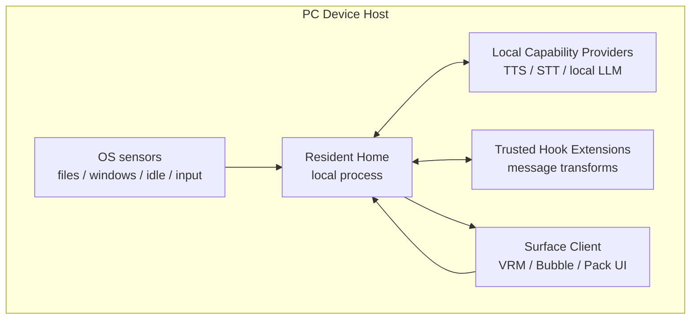
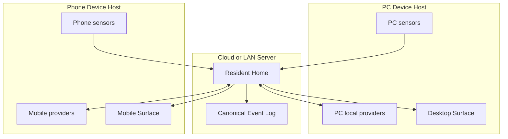
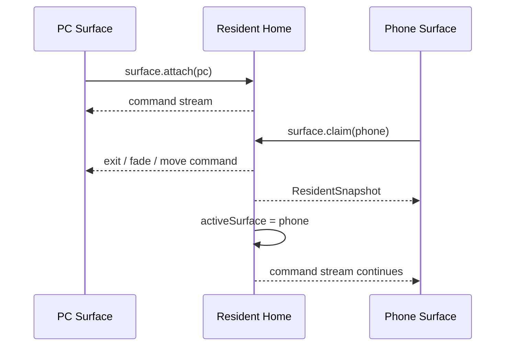

# Architecture: Resident Mesh

Yuukeiは、単一のデスクトップアプリではなく、Resident Homeを中心にしたResident Meshとして設計する。Resident Homeはローカルでもクラウドでも動ける。PCやスマホは、その住人の身体、感覚器、能力提供者になる。

## Components

### Resident Home

住人の継続性を持つ中核。ローカル常駐サーバーとしても、クラウド上のサービスとしても動ける。

責務:

- active World Packを読み、住人、台本、信号、権限を解釈する。
- Daihon Hostを呼び、決定的な生活イベントを実行する。
- canonical event logを保存する。
- 現在の住人状態、Surface状態、短期状態を管理する。
- Capability Providerを選び、LLM、TTS、STT、記憶エンジンなどを呼ぶ。
- Trusted Hook Extensionの登録、順序、権限、hook結果の記録を管理する。
- Surface Clientへsnapshotとcommand streamを配信する。

持たない責務:

- 特定LLMの実装。
- 特定の長期記憶DBやembedding方式。
- Tauri window操作。
- PCやスマホのOS API直接呼び出し。
- VRMやLive2Dの描画実装。

### Device Host

端末ごとに動くローカルホスト。PC、スマホ、将来の専用端末ごとに存在する。

責務:

- OS観測、ユーザー操作、端末状態をRuntimeEventとしてResident Homeへ送る。
- ローカルCapability Providerを起動・登録する。
- ローカルTrusted Hook Extensionを起動・登録する。
- Surface Clientを起動・管理する。
- ローカル権限、OS権限、端末固有の安全境界を扱う。
- Resident Homeがクラウドにある場合、ローカル能力を安全に中継する。

Device Hostは人格や長期記憶を所有しない。端末が変わっても住人は同じであり続ける。

ユーザーがWorld Packディレクトリを選ぶ設定UIはDevice Hostに置いてよい。Device Hostはローカルファイルダイアログ、OS権限、選択パスの保存を扱う。ただし、active World Packの解釈、residentId、event logの分離、住人の継続性はResident Home側の起動設定として扱い、Surface Clientへ人格状態を持たせない。

### Surface Client

住人の身体と演出を担当する表示クライアント。

責務:

- ResidentSnapshotを受け取って現在状態を復元する。
- RuntimeCommandを受け取って、表情、動作、発話、位置、UI演出を表示する。
- ユーザーのジェスチャー、ドラッグ、会話入力をDevice HostまたはResident Homeへ送る。
- VRM、Live2D、2Dアニメーション、モバイルウィジェットなどの描画方式を実装する。

Surface Clientは、人格、記憶、Daihon実行、Capability選択を所有しない。

### Capability Provider

交換可能な能力提供者。ローカルプロセス、クラウドAPI、専用ハードウェア、別端末上のサービスのどれでもよい。

例:

- `dialogue.generate`: LLM応答生成。
- `speech.synthesis`: TTS。
- `speech.recognition`: STT。
- `memory.index`: event logから独自記憶DBを構築。
- `memory.retrieve`: 現在文脈に必要な記憶を検索。
- `embedding.generate`: embedding生成。
- `vision.observe`: 画像・カメラ文脈の認識。

Capability Providerは、Coreの所有者ではない。複数Providerが同じcapabilityを提供でき、Resident Homeが選択・許可・呼び出しを管理する。

### Trusted Hook Extension

ユーザーまたは開発者が、公開protocol上の出来事や命令へ介入する拡張。Capability Providerが「能力を提供する」のに対し、Hook Extensionは「既存の処理の通過点でmessageを観測または変換する」。

例:

- `beforeCommandEmit`: `dialogue.say` などの `RuntimeCommand` をSurfaceへ送る直前に変換する。
- `onEventAppended`: event logへ保存された出来事を観測し、必要なら新しい `RuntimeEvent` を提案する。
- `onCapabilityInvocation`: capability呼び出しを観測し、外部サービス連携や補助情報を加える。

Hook ExtensionはCore内部オブジェクト、Surface実装、event logファイルを直接変更しない。入力として公開protocol messageのコピーを受け取り、変更案をResident Homeへ返す。Resident Homeは結果を検証し、採用した変換をcanonical event logへ記録してから次の境界へ流す。

### World Pack

世界観、住人、台本、UI生活空間の解釈を持つデータパック。Yuukeiの体験を差し替える主単位。

World PackはOS APIやAI APIを直接呼ばない。必要な能力はcapabilityとして宣言し、Resident HomeがProviderへルーティングする。

ユーザーが外部World Packを選んだ場合も、Packは外部ディレクトリとして参照されるデータであり、OSファイル選択やパス保存を自分では行わない。Packごとの生活史を混ぜないため、Device Hostは選択されたPack installに対応するresident/event-log保存先をResident Homeへ渡す。

### Daihon Host

Daihon台本を評価する実行境界。Resident Homeから見て、Daihon Hostは交換可能なsidecarまたはサービスである。Daihon Hostは長期状態、Surface、OS観測を所有しない。

## Local-First Layout

最初の実装はこの構成でよい。すべて同一マシン上で動いても、境界は将来のリモート化を前提に通信protocolとして切る。

## Cloud-Capable Layout

クラウド構成でも、ローカルTTSやローカルLLMはDevice Hostに残せる。Resident Homeはcapabilityを呼ぶだけで、能力がどの端末にあるかを意識しすぎない。

## Moving Between Surfaces

スマホ移動は、人格や記憶を移すことではない。Resident Homeが住人の継続性を持ち、アクティブなSurfaceを切り替える。Surfaceは住人の身体であり、住人そのものではない。

## Implementation Bias

Rust/Tauriは最初のDevice HostとDesktop Surfaceに向いている。Resident HomeはRustでよいが、Tauri型、WebView、window handle、OS APIを内部に入れない。通信境界、event log、capability routingを先に作り、UIやOS観測はDevice Host側に置く。
