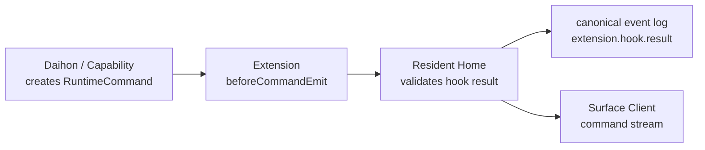

# Protocols: 意味境界の通信契約

Yuukeiの境界は、ライブラリ呼び出しではなくprotocolとして扱う。最初は同一プロセス内の関数でもよいが、設計上はJSON-RPCまたはWebSocketで分離できる形にする。

完全なスキーマを早く固定しすぎない。固定するのは、意味境界を保つために必要な概念フィールドだけにする。

## Common Envelope

多くのmessageは次の概念フィールドを持つ。

```ts
type YuukeiMessage = {
  id: string;
  type: string;
  timestamp: string;
  source: string;
  residentId: string;
  payload: Record<string, unknown>;
  causality?: {
    sourceEventId?: string;
    sourceCommandId?: string;
    traceId?: string;
  };
};
```

- `id`: message自身の一意ID。
- `type`: `conversation.text`, `dialogue.say`, `surface.claim` のような意味名。
- `timestamp`: 発生時刻。順序保証とは別に保持する。
- `source`: `user`, `device`, `surface`, `daihon`, `capability`, `system` など。
- `residentId`: どの住人の生活史に属するか。
- `payload`: typeごとの本文。ここに巨大な観測全体を詰め込まない。
- `causality`: 何に反応して生まれたmessageか。

端末やSurfaceに関わるmessageは、必要に応じて `deviceId`、`surfaceId`、`sessionId` を追加する。

## RuntimeEvent

外界からResident Homeへ入るcanonical input。ユーザー操作、OS観測、端末状態、Surface上のジェスチャー、Presence tickを表す。

```ts
type RuntimeEvent = YuukeiMessage & {
  deviceId?: string;
  surfaceId?: string;
  actorId?: string;
  privacy?: {
    category: string;
    retention: "session" | "short" | "long" | "manual";
    extensionReadable: boolean;
  };
};
```

`privacy` は機微な観測に付ける任意フィールドで、event log record(04)の `privacy` へそのまま引き継がれる。デスクトップ観測は `category: "desktop-observation"`、retention `short` を使う。

例:

- `conversation.text`: ユーザーが話しかけた。
- `conversation.choice`: 提示された選択肢からユーザーが選んだ。payloadは `choiceId`、`choice`(選ばれた表示文字列)、`index`。
- `avatar.gesture.poke`: Surface上で住人に触れた。
- `avatar.gesture.grab`: 長押し(500ms)で住人がつままれ、持ち上げが始まった。
- `avatar.gesture.drop`: つままれていた住人が置かれた。payloadは `movedDistance`(持ち上げ位置からの移動量、logical px、整数へ丸める)。
- `presence.life_tick`: 生活時計が進んだ。
- `presence.talk_impulse`: Device Hostのおしゃべりタイマーが、台本上の定期的なひとりごと候補を起こした。
- `ext.yuukei-intelligence.mood.changed`: 公式Intelligence Extensionが、最近の出来事から住人の気分を評価した。
- `device.wake`: 端末が復帰した。
- `desktop.window.appeared`: デスクトップに新しいウィンドウが現れた。
- `desktop.window.closed`: ウィンドウが消えた。
- `desktop.window.focused`: 前面のウィンドウが変わった。
- `desktop.folder.opened`: Finder/Explorerで既知カテゴリのフォルダが表示された。
- `desktop.download.completed`: Downloadsへ新しいファイルが追加された。
- `mobile.location.changed`: スマホ側で位置文脈が変わった。

### Desktop Terrain Observation

「OSのUIは住人にとっての地形」(01)を支える観測群。Device Hostのobserverが観測し、canonical signal化する。**機微な観測は明示権限**(04)であり、観測の種類(ウィンドウ / フォルダ / ダウンロード)ごとにユーザーがON/OFFでき、既定はすべてOFF。初回導入時に世界観を壊さない形で有効化を促す。

- `desktop.window.appeared` / `desktop.window.closed` / `desktop.window.focused`: payloadは `windowKey`(セッション内で安定な不透明ID)と `app`(アプリ名を正規化した文字列)。**ウィンドウタイトルは記録しない**。位置・サイズの変化はevent logへ流さず、Device Host内の地形スナップショット(perch追従用)だけが持つ。`focused` は1秒未満の切り替えをデバウンスする。
- `desktop.folder.opened`: payloadは `category`(`downloads` / `desktop` / `documents` / `pictures` / `trash` / `other`)と `app`(`finder` / `explorer`)。**生のパスは記録しない**。同じフォルダの連続再通知はデバウンスする。実装はWindows(IShellWindows)を優先し、macOS(Accessibility/Scripting、要権限)はベストエフォート。
- `desktop.download.completed`: Downloadsディレクトリのwatcherから発行する。payloadは `fileName` と `fileCategory`(`image` / `video` / `audio` / `document` / `archive` / `app` / `other`)。フルパスは記録しない。ブラウザの一時ファイル(`.crdownload` / `.part` 等)は完了までイベント化しない。
- これらのrecordには `privacy.category: "desktop-observation"` を付け、event log閲覧・削除UI(M4)の対象にする。

Daihon向け標準別名は `窓_出現` / `窓_消滅` / `窓_注目` / `フォルダ_開いた` / `ダウンロード_完了`。Daihonへは、payloadのキーに加えて次の日本語入力名を渡す: `desktop.window.*` では `入力#アプリ`(app)と `入力#窓ID`(windowKey)、`desktop.folder.opened` では `入力#フォルダ`(category)と `入力#アプリ`、`desktop.download.completed` では `入力#ファイル名`(fileName)と `入力#ファイル種類`(fileCategory)。

`desktop.folder.opened` のdispatch時、Resident Homeはevent logの直近7日から最新の `desktop.download.completed` を1件探し、`入力#最近のダウンロード`(fileName)と `入力#最近のダウンロード種類`(fileCategory)として渡す(見つからなければ空文字)。「この前ダウンロードしたものへ住人が反応する」sceneはこれで書ける。

RuntimeEventはevent logへ保存される。個人情報や重い観測は、権限付きのcontext referenceとして扱い、event payloadへ無制限に埋め込まない。

### Daihon Signal Aliases

`RuntimeEvent.type` とevent logは常に `device.wake` のようなcanonical IDを使う。一方でDaihon作者は、IME切り替えなしで書ける標準別名を使える。

標準例:

- `会話_入力` -> `conversation.text`
- `画面_接続` -> `surface.attach`
- `アプリ_起動` -> `app.startup`
- `生活_定期` -> `presence.life_tick`
- `雑談_定期` -> `presence.talk_impulse`
- `時間帯_変化` -> `presence.time_period`
- `端末_スリープ前` -> `device.sleep.before`
- `端末_復帰` -> `device.wake`
- `住人_つつく` -> `avatar.gesture.poke`
- `住人_なでる` -> `avatar.gesture.pat`
- `住人_つまむ` -> `avatar.gesture.grab`
- `住人_おろす` -> `avatar.gesture.drop`
- `住人_歩き終わり` -> `stage.walk.ended`
- `不在_開始` -> `presence.idle.start`
- `復帰` -> `presence.idle.end`
- `窓_出現` -> `desktop.window.appeared`
- `窓_消滅` -> `desktop.window.closed`
- `窓_注目` -> `desktop.window.focused`
- `フォルダ_開いた` -> `desktop.folder.opened`
- `ダウンロード_完了` -> `desktop.download.completed`

`presence.life_tick` は生活時計の定期進行を表し、ユーザーが無操作状態であることは意味しない。実際のidle検出は別のcanonical signalとしてDevice Hostが観測する。Device HostはOSの無操作時間(最後のキーボード・マウス入力からの経過秒)を既存のpresence tickで定期サンプリングし、しきい値(既定300秒)を超えた時点で `presence.idle.start`(payload: `thresholdSeconds`)を発行する。その後に操作が再開されたら `presence.idle.end`(payload: `idleMinutes`、`idleSeconds`)を発行する。Daihonには `presence.idle.end` の不在時間が `入力#不在分` としても渡される。無操作時間を取得できないプラットフォームでは、この観測は発行されないだけで他へ影響しない。

Daihon load時にYuukei側のWorld/Daihon境界で標準別名をcanonical IDへ解決する。Daihon core自体はYuukei固有signal辞書を所有しない。

ExtensionはmanifestでDaihon signal aliasを寄贈できる。

```ts
type ExtensionSignalAlias = {
  alias: string;
  signal: string; // ext.<extensionId>.*
};
```

例: `活動時間_開始` -> `ext.activity.active-period.start`。Resident Homeは有効なExtensionのaliasだけをWorld/Daihon境界へ渡す。World PackやDaihonが未導入または無効なExtensionのaliasに依存している場合、そのaliasはcanonical IDへ解決されず、該当トリガーが発火しないだけにする。

公式Intelligence Extensionは `気分_変化` -> `ext.yuukei-intelligence.mood.changed` を寄贈できる。

## RuntimeCommand

Resident HomeからSurface ClientまたはDevice Hostへ出る命令。住人の見える振る舞いを表す。

```ts
type RuntimeCommand = YuukeiMessage & {
  target?: {
    deviceId?: string;
    surfaceId?: string;
    actorId?: string;
  };
};
```

例:

- `dialogue.say`: セリフを表示する。
- `dialogue.choices`: 選択肢を表示する。
- `avatar.expression`: 表情を変える。
- `avatar.motion`: 動作を変える。`payload.motion` はWorld Packの `motions` に登録したモーションID。`loop` は省略時 `true`。`loop: false` のcommandはSurfaceが1回だけ再生し、終了時に任意の `returnMotion` へ遷移する。Resident Homeのsnapshotには単発動作そのものを残さず、`returnMotion`（省略時は空文字）を現在動作として保持するため、Surface再接続で驚きや着地を再演しない。
- `actor.location.set`: 住人の意味上の現在地を変える。payloadの `location` は空でない安定した場所IDであり、OSの実パスや画面座標ではない。在席状態は変えない。
- `actor.exit`: 住人を現在のSurfaceの舞台から退場させ、`presence` を `away` にする。payloadに `location` があれば、退場と同時に現在地も原子的に変える。
- `actor.enter`: 住人を現在のSurfaceの舞台へ登場させ、`presence` を `present` にする。payloadに `location` があれば、登場と同時に現在地も原子的に変える。省略時は現在地を保つ。
- `surface.move`: Surface内または画面上の位置を変える。
- `surface.attach`: ウィンドウ、フォルダ、スマホウィジェットなどに寄り添う。
- `ui.notification`: 通知として現れる。
- `ui.error_burst`: エラー群のような感情表現を出す。
- `audio.play`: 音声、UI音、環境音を再生する。

Desktop Surfaceでは、デスクトップ全体を一つの舞台として扱うため、Device Host側の `DesktopStageManager` が高水準の演出命令を実際のwindow操作やoverlay描画へ変換する。DaihonやResident HomeはOS window handle、Tauri `AppHandle`、WebView、Finder/Explorer APIを直接扱わない。

`actor.exit` / `actor.enter` の対象はcommandの `target.actorId` である。Desktop Surfaceはawayのactor windowを隠し、その住人宛の吹き出し、選択肢、音声も提示しない。command自体は生活史として通常どおり記録される。`actor.location.set`、`actor.exit`、`actor.enter` の最新結果はResidentSnapshotへ反映され、Surfaceの再接続とResident Homeのevent-log replayで復元できる。

Resident HomeはDaihon dispatch時、eventの `actorId` が指す住人、指定がなければWorld Packのdefault actorについて、現在の `location` と `presence` を派生contextとしてそれぞれ `入力#場所`、`入力#在席` へ渡す。canonical event本体へこの派生値を追記はしない。

Desktop Stage向けのcommand family:

- `actor.place`: 住人を画面上のanchorへ移動する。`payload.anchor` は `screenRect`、`activeWindow`、将来の `osWindow` などの意味的anchorを持てる。Device Hostが許可済みOS観測から座標へ解決し、解決不能なら安全なfallback位置を使う。
- `screen.effect.start`: 雨、暗転、画面揺れ、集中線などのscreen-wide effectを開始する。`payload.kind`、`effectId`、`durationMs`、`intensity`、`clickThrough` などを持てる。
- `screen.effect.stop`: `effectId` または `kind` を指定してscreen-wide effectを止める。
- `screen.dialogBurst.start`: 偽エラーダイアログなどの演出overlayを開始する。実OS native dialogを大量生成せず、Yuukei所有の透明overlay window上に描画する。
- `screen.dialogBurst.clear`: dialog burstを全消去する。ESCやemergency clearなど、Device Host側の安全操作からも呼べる。
- `stage.perch`: 住人を対象ウィンドウの枠(v1は上辺のみ)へ座らせる。`payload.windowKey` で対象を指定し、Device Hostが地形スナップショットから座標へ解決して追従する(対象の移動・リサイズに追いつく)。対象ウィンドウが消えたら住人はデスクトップ(通常位置)へ降り、`stage.perch.ended`(reason: `window-closed`)をRuntimeEventとして返す。配置はウィンドウ単位まで。フォルダ内アイコン単位の座標はv1では扱わない。
- `stage.perch.release`: 座っている住人をデスクトップへ降ろす。
- `stage.walk`: 住人を同一モニタ内で水平に歩かせる(v1は水平のみ、モニタをまたがない)。payloadは `destination`(`right-edge` | `left-edge`)、`motion`(World Packの `motions` に登録したモーションID。省略時 `walk`)、`speedPxPerSec`(省略時 240)。Device Hostがactor windowを一定速度で目標x(モニタ端、余白はDevice Hostが決める)へ動かす。perch中に受けたら先に座りを解除する(`stage.perch.ended` reason: `walk`)。歩行が終わったら `stage.walk.ended` RuntimeEvent(payload: `reason` = `arrived` | `user-drag` | `replaced`)を返し、最終位置をstage状態として永続化する(02)。歩行中につままれたら中断(`user-drag`)、新しい `stage.walk` を受けたら置き換え(`replaced`)。
- 歩行中の見た目はsnapshot経由で伝える。Resident Homeは `stage.walk` commandの通過時にactorの `motion`(payloadの `motion`)と `heading`(`destination` から導出した `left` | `right`)を設定し、`stage.walk.ended` RuntimeEventで両方を既定(空文字=正面・静止)へ戻す。Surfaceは `heading` が付いている間、住人を進行方向へ向けて描画する。`heading` は `ActorSnapshot` のfieldで、空文字が正面を意味する。

ユーザーは住人を長押し(500ms)でつまんで、デスクトップの好きな場所へ動かせる。長押し未満のクリックは従来どおり `avatar.gesture.poke`。つまんだ時点で `avatar.gesture.grab` が発行され、perch中なら座りは解除されて `stage.perch.ended`(reason: `user-drag`)が返る。移動中はOSネイティブのウィンドウドラッグを使い、離した位置はモニタ内へクランプして確定、`avatar.gesture.drop` が発行される。確定した位置はDevice Hostのstage状態として永続化される(02)。

これらは演出意図のprotocolであり、OS API呼び出しそのものではない。World PackとDaihonは「雨を降らせる」「この住人をこのanchorに座らせる」といった意図を出し、Desktop Device HostとSurfaceがmonitor、actor window、bubble、effect overlay、OS window anchor、cursorなどの整合性を管理する。

RuntimeCommandはSurfaceにとっての描画命令であり、長期状態のsource of truthではない。再接続時はcommand履歴ではなくResidentSnapshotを使って復元する。

`dialogue.choices` は、住人の問いかけへの返答候補をユーザーに提示する。payloadは `choiceId`(この提示の一意ID)、`choices`(表示文字列の配列)、`timeoutSeconds` を持つ。ユーザーの選択はSurfaceが `conversation.choice` RuntimeEventとして返す。タイムアウトなどで提示を畳むときは、Resident Homeが `dialogue.choices.clear`(payload: `choiceId`、`reason`)を発行する。Daihonの `選択` 式が選択を待っている間の後続eventの扱いは `解釈` のin-flightと同じで、`conversation.` で始まるeventはキューされ、それ以外は記録のみになる。ただし待ち合わせ中の `choiceId` に一致する `conversation.choice` はキューではなく待ち合わせの解決に使い、一致しない `conversation.choice` は記録だけして破棄する。

`dialogue.say` は、表示テキスト、話者、口調、emotion、任意の `speechRef` を持てる。音声そのものをcommandへ埋め込まず、音声、viseme、文字単位または句単位のtimingは `speech.synthesis` の結果として参照する。

Desktop Surfaceの吹き出しは住人ごとに同時に1個までとする。`DesktopStageManager` が住人単位で「表示中の吹き出し」と「待機キュー」を持ち、`dialogue.say` を受けたときの扱いは次の通り。

- 表示中の吹き出しがなければ即表示する。
- 表示中があり、同じシーンのセリフ(causalityの `sourceEventId` が表示中の吹き出しと一致)なら待機キューの末尾へ並べる。
- 別シーンのセリフ(`sourceEventId` が異なる、またはcausalityなし)なら待機キューを破棄し、表示中を即置き換える。
- ただし表示中の吹き出しに未解決の選択肢(`dialogue.choices`)が付いている間は表示中の置き換えを行わない。同一シーンのセリフは通常どおりキュー末尾へ、別シーンのセリフは待機キューを破棄したうえでキューに入り、選択肢の解決後に順に表示される(連打しても最後のシーンだけが残る)。

表示時間は、payloadに `durationMs` があればそれを優先し、なければ文字数×90msを2.5〜9秒へクランプした読み時間とする。ユーザーが吹き出しへホバー/フォーカスしている間は消滅が延期され、その間は待機キューも進まない(別シーンによる即置き換えだけはホバー中でも起きる)。表示中の吹き出しが消えたら(期限切れまたは明示dismiss)、待機キューの先頭を次に表示する。選択肢だけの吹き出しを新規に作るときの表示時間は `timeoutSeconds`(5〜600秒)をそのまま尊重し、セリフ用の上限へはクランプしない。

吹き出しのテキストは逐次表示(タイプライター)を基本とし、音声があるときは再生に同期させる。

- Resident Homeは、健全な `speech.synthesis` providerがありtextが空でない `dialogue.say` に `payload.speechPending: true` を付与する。Surfaceはこのフラグで「音声が来る見込み」を知る。
- `speechPending` 付きの吹き出しは、枠と「…」プレースホルダで即表示する。対応する `audio.play`(causalityの `sourceCommandId` が吹き出しIDと一致し、`durationMs` を持つ)が来たら、その時点から音声の実長にわたってテキストを線形に逐次表示する。
- `audio.play` が猶予時間(5秒)以内に来なければ、推定速度での逐次表示にフォールバックする(合成失敗・timeout対策。Resident Home側の合成timeoutは10秒)。フォールバック開始後に音声が届いた場合、表示済みの文字は巻き戻さず、表示進捗は「推定速度の進捗」と「音声同期の進捗」の大きい方を取る。
- `speechPending` なし(声を持たない住人、provider不在)の吹き出しは、表示直後から推定速度で逐次表示する。逐次表示は表示時間が尽きる前に必ず全文に到達させる。
- 寿命の同期: `speechPending` 付き吹き出しの初期表示時間は「フォールバック猶予+読み時間」とする。対応する `audio.play` が届いたら、表示時間を max(読み時間, 表示からの経過+音声実長+余韻1.5秒) に置き換える。payloadに明示 `durationMs` がある場合も、音声がそれより長ければ同様に延長する(音声再生中に吹き出しが先へ消えることを防ぐ)。`audio.play` の `durationMs` が欠けている場合は推定速度フォールバックと同じ扱いにする。
- 吹き出しの大きさは全文で確保し、逐次表示の進行で伸縮させない。未解決の選択肢はテキストの逐次表示と独立に即表示する。
- 対応する吹き出しがすでに消えている・置き換えられている `audio.play` は、表示状態に影響を与えない(再生は従来どおり後勝ち1本)。

Daihon作者がWorld Packの `speakerAliases` を使って短く書いた場合も、RuntimeCommandに出る話者はcanonical actor IDへ正規化する。SurfaceやExtensionは `ゆ` や `パ` のような台本上の短縮名を解釈せず、`target.actorId` と `payload.speakerId` のcanonical actor IDだけを扱う。

## Extensions

Extensionは、Core内部関数ではなく公開protocol messageを対象にする。能力提供、message変換、event log購読、RuntimeEvent発行、Daihon signal alias寄贈は、単一のmanifestモデルで宣言する。権限ゼロまたは少数権限のExtensionが軽量な修整層になり、多数の権限を宣言するExtensionがフル拡張になる。

```ts
type ExtensionRuntimeKind = "process" | "bundled" | "wasm";

type ExtensionPermissions = {
  broadEventSubscription: boolean;
  eventLogRead?: {
    eventTypes: string[];
    privacyCategories: string[];
    allowPayloads: boolean;
    allowReferences: boolean;
    maxRecords: number;
    purpose: string;
  };
};
```

v1の `process` runtimeでは、permissionsは「宣言とユーザー同意」のための境界であり、OSレベルsandboxによるenforcementではない。Resident Homeは公開protocol上の入力/出力を検証するが、process自体の任意ファイルアクセスをOS権限で隔離するとは約束しない。将来の `wasm` などの軽量runtimeで、権限ゼロExtensionを実際にsandbox実行できる余地を残す。

### beforeCommandEmit

最小のhook pointは `beforeCommandEmit` であり、Resident Homeが `RuntimeCommand` をSurfaceへ配信する前に、登録済みExtensionへcommandのコピーを渡す。

```ts
type ExtensionHookPoint = "beforeCommandEmit";

type ExtensionHookSubscription = {
  hookPoint: ExtensionHookPoint;
  commandTypes: string[];
};

type ExtensionHookInvocation = {
  id: string;
  hookPoint: ExtensionHookPoint;
  extensionId: string;
  residentId: string;
  worldPackId: string;
  command: RuntimeCommand;
};

type ExtensionHookResult =
  | { action: "unchanged"; metadata?: Record<string, unknown> }
  | { action: "replaceCommand"; command: RuntimeCommand; metadata?: Record<string, unknown> };
```

`replaceCommand` は、同じ `id`、`type`、`residentId` を持つcommandだけを返せる。これにより、Extensionは `dialogue.say.payload.text` を変えるような自由な加工を行えるが、commandの同一性や生活史の因果関係を壊さない。

Extensionが失敗した場合、Resident Homeは元のcommandを維持し、`extension.hook.result` にerrorを記録して処理を続行する。

同じhook pointへ複数のExtensionが登録された場合、実行順はユーザー設定のhook orderで決める。`beforeCommandEmit` では、各Extensionの出力commandを次のExtensionの入力commandにする。manifestに開発者指定priorityは持たせない。削除済みIDは無視し、disabledのExtensionは順序設定に残っていても実行しない。



例: 語尾を足すExtensionは `dialogue.say` commandを受け取り、`payload.text` を変えたcommandを返す。Surfaceやevent logファイルを直接変更しない。

### onEventAppended

Resident Homeがcanonical event logへ `RuntimeEvent` を追記するたび、購読Extensionへコピーを配る。manifestは `eventTypes` フィルタを宣言する。パターンは完全一致、prefix `*`、または全イベント `*` を扱う。`*` は実質的にキーロガーになり得るため、`permissions.broadEventSubscription: true` を必須にする。

```ts
type ExtensionEventSubscription = {
  eventTypes: string[];
};

type ExtensionEventInvocation = {
  id: string;
  extensionId: string;
  residentId: string;
  worldPackId: string;
  event: EventLogRecord;
};

type ExtensionEventResult = {
  proposedEvents: RuntimeEvent[];
  metadata?: Record<string, unknown>;
};
```

Extensionが新しいRuntimeEventを提案する場合、Resident Homeは次を必ず検証・付与する。

- event typeは `ext.<extensionId>.` で始まる。
- event typeはmanifestの `emittedEvents` に一致する。
- `source` はResident Homeが `extension` に上書きする。
- `causality.sourceEventId` は元eventに結びつける。
- 拡張発eventには `yuukeiExtension.extensionId` と `yuukeiExtension.hopCount` を付ける。
- Extensionは自分自身が発行したeventを購読できない。
- hop countが上限を超えた提案は破棄し、`extension.event.rejected` として記録する。

組み込みeventである `conversation.text` や `device.wake` をExtensionが偽造することはできない。語彙を増やす場合は、Extension自身の名前空間に新しいevent typeを追加し、Daihon aliasを寄贈する。

## ResidentSnapshot

Surfaceが途中参加、再接続、端末移動したときに現在状態を復元するための状態。

```ts
type ResidentSnapshot = {
  residentId: string;
  worldPackId: string;
  activeSurfaceId?: string;
  actors: Record<string, {
    displayName: string;
    expression: string;
    motion: string;
    heading: string;
    location: string;
    presence: "present" | "away";
    speaking?: boolean;
    bubble?: string;
  }>;
  surfaces: Record<string, SurfaceSession>;
  capabilities: Record<string, CapabilityRouteSummary>;
  extensions: Record<string, ExtensionSummary>;
  recentEventCursor: string;
};
```

SnapshotはSurface向けの現在状態であり、記憶DBの内容を直接含めない。必要な文脈はResident HomeがCapability呼び出し時に渡す。

## SurfaceSession

Surface ClientとResident Homeの接続単位。

```ts
type SurfaceSession = {
  surfaceId: string;
  deviceId: string;
  kind: "cli" | "desktop" | "mobile" | "widget" | "overlay" | "effect";
  active: boolean;
  capabilities: string[];
  presentation: {
    renderer?: "terminal" | "vrm" | "live2d" | "sprite" | "html";
    transparent?: boolean;
    acceptsInput?: boolean;
  };
};
```

Surfaceは `surface.attach` で接続し、`snapshot.subscribe` と `command.subscribe` を開始する。スマホ移動やPC復帰では、`surface.claim` によりactive surfaceを切り替える。

Surfaceが離脱するときは `surface.release` を送る。Resident Homeは必要なら別Surfaceをactiveにするか、次のattachまで住人をheadless状態として扱う。

CLI Surfaceは開発・検証用の正式なSurfaceである。`terminal` rendererは、`dialogue.say` などの描画命令を端末表示へ変換し、ユーザー入力を `conversation.text` として返す。Surfaceが人格や長期状態を持たないという制約はTauri版と同じである。

### CLI Surfaceの番号入力状態機械

CLI Surfaceの目的は、GUI(desktop Surface)と同じcanonical signalを同じResident Home入口へ流し、不具合がCore側(Resident Home / Daihon / Device Host)かSurface側(ジェスチャー認識・描画)かを切り分けることである。GUIで再現する不具合がCLIでも再現すればCore側、CLIで再現しなければSurface側と判定できる。このためCLIは番号入力の状態機械として仕様を固定し、GUIのジェスチャー認識器と対になる「もう1つの入力面」として扱う。

#### 入力規約

- 1行が1入力。メニュー状態では番号のみを受理し、値入力状態(セリフ・パス・移動距離)では行全体を値として受理する。
- `0` は常に「戻る」。トップメニューでは「終了」を意味する。
- EOF(パイプ終端)は終了と同義。
- 不正入力はエラーを出力して**同じ状態に留まる**(遷移しない)。番号がずれたスクリプトを早期に検出するため。
- 値入力状態での空行は「キャンセルして親メニューへ戻る」。メニュー状態での空行は無視する。

#### 出力規約

- メニュー表示・プロンプト・エラーは stderr へ、実行結果(発行されたRuntimeCommand、snapshot等)は stdout へ出す。パイプ実行時にstdoutだけを検証対象にできる。
- 出力モードは `human`(既定)と `jsonl`(RuntimeCommand 1件=1行のJSON)。トップメニュー10で切り替えられ、環境変数 `YUUKEI_CLI_OUTPUT=jsonl` で起動時にも指定できる。

#### トップメニュー(番号は仕様として固定)

項目を追加するときは末尾に新しい番号を割り当て、既存番号を変更しない。

| 番号 | 項目 | 遷移 | Coreへ入るsignal |
|---|---|---|---|
| 1 | 撫でる/つつく | アクター選択 → ヒットゾーン選択 → 実行 | `avatar.gesture.poke` |
| 2 | つまむ | アクター選択 → 実行 | `avatar.gesture.grab` |
| 3 | おろす | アクター選択 → 移動距離入力 → 実行 | `avatar.gesture.drop` |
| 4 | 話しかける | セリフ入力 → 実行 | `conversation.text` |
| 5 | 状態を見る | snapshotをstdoutへ出力 | — |
| 6 | コマンド履歴 | 履歴一覧をstdoutへ出力 | — |
| 7 | World Pack | サブメニュー: 1 選択(パス入力) / 2 リセット / 3 状態表示 | — |
| 8 | 拡張機能 | サブメニュー: 1 インストール(パス入力) / 2以降 動的一覧(選択で有効⇄無効) | — |
| 9 | ログとパス | サブメニュー: 1 イベントログ書き出し(パス入力) / 2 パス表示 | — |
| 10 | 出力モード切替 | human ⇄ jsonl | — |
| 0 | 終了 | — | — |

- 動的一覧(アクター、ヒットゾーン、拡張機能)は、固定項目の後にID辞書順で 1..N(拡張機能は 2..N+1)を割り当て、番号を安定させる。0 は戻る。
- ジェスチャーはGUIと同じDevice Host入口(`send_avatar_gesture_poke` / `send_avatar_gesture_grab` / `send_avatar_gesture_drop`)を呼ぶ。ヒットゾーンはactive World Packのavatar定義(`hitZones`)から列挙する。
- CLIが実ポインタを持たないため、pokeの付帯フィールドは固定値 `input: {kind: "cli", button: "none"}`、`screen: {x: 0, y: 0}`、`hitSurface: "unknown"` とする。`"unknown"` はdesktop Surfaceが素材判定に失敗したときのフォールバック値と同じであり、GUIからの信号と同じ形を保つ(台本は `入力#hitSurface` を常に参照できる)。`hitBone` は送らない(現状どのpackも参照していない)。

例: default packで「yuukeiの頭を撫でる」は `printf '1\n2\n1\n0\n' | yuukei-cli-surface`(1 撫でる → アクター2 yuukei → ヒットゾーン1 head → 0 終了。アクター番号はID辞書順のため partner=1, yuukei=2)。

#### 決定性

- CLI Surfaceでは presence loop(生活時計)を既定で起動しない。パイプ実行の検証結果にタイマー由来のコマンドが混ざることを防ぐため。
- 環境変数 `YUUKEI_CLI_PRESENCE=1` で有効化できる。

#### コマンドラインフラグ

受け付けるフラグは `-h` / `--help` のみ。従来の `--say` などの機能別フラグは廃止し、すべて番号メニュー(パイプ入力可)で行う。

## CapabilityInvocation

Resident Homeが、選択されたExtensionへ能力を依頼するRPC。`CapabilityRouter` は内部機構として名前付きcapabilityからExtension IDへルーティングする。

```ts
type CapabilityInvocation = {
  id: string;
  capability: string;
  method: string;
  residentId: string;
  actorId?: string;
  input: Record<string, unknown>;
  context?: {
    eventIds?: string[];
    memoryHints?: unknown[];
    actorProfile?: unknown;
    device?: unknown;
  };
};
```

代表capability:

- `dialogue.generate`: 台本の余白を埋める発話生成。
- `dialogue.interpret`: 台本の `解釈` 式が渡す入力文を、選択肢のどれか(または `不明`)へ分類する。文章は生成しない。
- `dialogue.extract`: 台本の `抽出` 式が渡す入力文から、指示された値を短い文字列(または `不明`)として取り出す。文章は生成しない。
- `speech.synthesis`: 表示テキストから音声、viseme、timingを生成。
- `speech.recognition`: 音声入力をテキストへ変換。
- `memory.index`: canonical event logからExtension固有の記憶索引を作る。
- `memory.retrieve`: 現在文脈から必要な記憶を取り出す。
- `memory.list` / `memory.update` / `memory.forget`: 設定画面からの派生記憶の閲覧、factテキストの編集、個別または全部の忘却。
- `mood.evaluate`: 最近の出来事から住人の現在の気分を固定語彙、話したい度、短い話題として評価する。
- `embedding.generate`: Memory Extensionなどが使うembedding生成。

Extensionは内部DBや外部APIを自由に使える。ただし、event logを改変しない。Extensionが生成した派生物はExtensionの所有物であり、再index可能であるべき。

`dialogue.generate` の出力はプレーンテキストではなく、次の構造化出力にする。

```ts
type DialogueGenerateOutput = {
  speak: boolean;
  text?: string;
  expression?: string;
  motion?: string;
};
```

`speak: false` は正当な結果であり、Resident Homeはcommandを発行しない。`speak: true` の場合だけ、Resident Homeがdefault actor宛の `dialogue.say` と、必要に応じて `avatar.expression` / `avatar.motion` を作る。

Capability route登録は、少なくともExtension ID、提供capability、必要権限、実行場所、設定schema、health状態を持つ。設定画面はDevice Hostが表示してよいが、設定値の所有と権限管理はResident Homeに寄せる。

### Extension Settings Schema

Extensionは任意でmanifestに `settings` を宣言できる。Extension自身は設定UIを持たず、Device Hostが汎用フォームとして描画する。

```ts
type ExtensionSettingsSchema = {
  fields: ExtensionSettingField[];
};

type ExtensionSettingField =
  | { key: string; type: "string"; label: string; description?: string; default?: string; visibleWhen?: { key: string; equals: unknown } }
  | { key: string; type: "number"; label: string; description?: string; default?: number; min?: number; max?: number; visibleWhen?: { key: string; equals: unknown } }
  | { key: string; type: "boolean"; label: string; description?: string; default?: boolean; visibleWhen?: { key: string; equals: unknown } }
  | { key: string; type: "select"; label: string; description?: string; options: { value: string; label: string }[]; default?: string; visibleWhen?: { key: string; equals: unknown } }
  | { key: string; type: "secret"; label: string; description?: string; visibleWhen?: { key: string; equals: unknown } };
```

`key` はExtension内で一意なflat keyであり、`gemini.apiKey` のようなドット区切りを許す。v1のfield typeは `string` / `number` / `boolean` / `select` / `secret` の5種だけにする。`visibleWhen` は単一条件だけを扱い、動的な選択肢照会や任意UIは持たせない。

Device Hostはmanifest load時に、keyの文字種と重複、`select.default` がoptions内にあること、`secret` がdefaultを持たないこと、`visibleWhen.key` が存在することを検証する。

非secret値は `YUUKEI_DATA_DIR/settings/extensions.json` の `extensionValues` に保存する。secret値は別ファイル `YUUKEI_DATA_DIR/settings/extension-secrets.json` に保存し、Unixでは0600で書く。API応答や設定画面stateにはsecret本文を含めず、設定済みkeyの一覧だけを返す。

process Extension起動時、Device Hostは有効値を `YUUKEI_EXTENSION_SETTINGS_JSON` にflat JSON objectとして渡す。有効値は保存済み非secret値と保存済みsecret値だけで構成する。schemaのdefaultはGUI表示用であり、ここへは焼き込まない。Extension自身のデフォルトや環境変数フォールバックは、ユーザーが明示的に保存していないkeyに対してのみ効く。schemaを持たないExtensionにはこの環境変数を渡さない。

### Capability Usage Metadata

LLMなど外部資源を使うcapabilityの応答には、任意で `usage` メタデータ(モデル名、入力/出力トークン数など)を載せられる。Resident Homeはこれをcapability実行結果の一部としてcanonical event logへ記録する。

使用量の集計は専用DBを持たず、Device Hostがevent logからstatelessに集計して設定画面へ読み取り専用で表示する。Extensionは自分の使用量を自己申告する立場であり、課金や制限の権威にはならない。

## Capability Composition

Extension同士は直接つながない。LLMが作った文でも、Daihonが書いた固定セリフでも、TTS Extensionは同じ `speech.synthesis` 入力を受け取る。

基本の合成手順:

1. Daihonまたは `dialogue.generate` が発話候補を作る。
2. Resident Homeが発話候補を `dialogue.say` commandとして正規化する。
3. 音声が必要なら、Resident Homeが同じtext、speaker、voice profile、emotion、display command IDを `speech.synthesis` に渡す。
4. TTS Extensionがaudio reference、duration、timing、viseme、subtitle alignmentを返す。
5. Surface Clientは `dialogue.say` と `speechRef` を合わせ、現在表示中の文字に音声を同期させる。

v1の実装は「再生開始の同期+全長ベースの逐次表示」とする。Resident Homeは `dialogue.say` を即時配信し(健全なproviderがあるときは `payload.speechPending: true` を付けて)、`speech.synthesis` routeが登録されている場合だけ並行して合成を依頼する。合成入力は `text`、`speakerId`(canonical actor ID)、`displayCommandId` で、出力は音声本体ではなく参照(`audioPath` などのローカル参照)と `durationMs`。成功時はResident Homeが `audio.play`(payload: `audioPath`、`durationMs`、causalityの `sourceCommandId` に元の `dialogue.say`)を発行し、Device Hostが再生するとともに、対応する吹き出しの寿命延長とテキスト逐次表示の起点にする(表示ルールはDesktop Surfaceの吹き出し節)。新しい `audio.play` が来たら再生中の音声は中断してよい。provider不在・timeout・失敗時は何も発行せず、テキスト表示は猶予後に推定速度の逐次表示へフォールバックする。モーラ単位の字幕同期やvisemeは将来の拡張に残す。

この構造により、TTS Extensionは文章がDaihon由来かLLM由来かを知らなくてよい。Memory Extensionも同様に、発話生成Extensionの内部事情ではなくevent logとcontextだけを読む。

## Device Host to Resident Home

Device Hostは端末ごとの感覚器であり、Resident Homeへ次を送る。

- 端末登録: `device.register`
- Surface登録: `surface.attach`
- ローカルExtension登録: `extension.register`
- OS観測: `os.*`
- Presence観測: `presence.*`, `device.*`
- ユーザー入力: `conversation.*`, `avatar.gesture.*`

Resident HomeはDevice Hostへ次を送る。

- Surface向けRuntimeCommand。
- capability呼び出し。
- Extension hook / event購読呼び出し。
- 権限要求または権限状態更新。
- ローカル観測の開始/停止要求。

Device Hostは、OS固有API、ローカルファイル、マイク、カメラ、位置情報などの権限境界を守る。Resident Homeがクラウドにある場合も、ローカル能力はDevice Hostが明示的に中継する。

## Protocol Rules

- 境界をまたぐmessageはJSONで表現できる形を基本にする。
- 大きなデータはURI、content-addressed blob、または権限付きreferenceで渡す。
- すべての重要な入力と出力はcausalityを持つ。
- RuntimeEventとRuntimeCommandはevent logへ記録できる形にする。
- Surfaceは命令を描画するだけで、人格や記憶を推測しない。
- Extension同士を直接つながない。Capability Routerを通す。
- ExtensionはCore内部状態ではなく公開messageを変換し、採用結果と正規化されたevent提案はevent logへ記録する。
