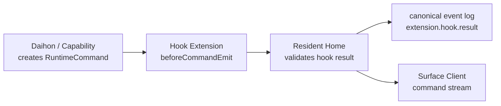

# Protocols: 意味境界の通信契約

Yuukeiの境界は、ライブラリ呼び出しではなくprotocolとして扱う。最初は同一プロセス内の関数でもよいが、設計上はJSON-RPCまたはWebSocketで分離できる形にする。

完全なスキーマを早く固定しすぎない。固定するのは、意味境界を保つために必要な概念フィールドだけにする。

## Common Envelope

多くのmessageは次の概念フィールドを持つ。

```ts
type YuukeiMessage = {
  id: string;
  type: string;
  timestamp: string;
  source: string;
  residentId: string;
  payload: Record<string, unknown>;
  causality?: {
    sourceEventId?: string;
    sourceCommandId?: string;
    traceId?: string;
  };
};
```

- `id`: message自身の一意ID。
- `type`: `conversation.text`, `dialogue.say`, `surface.claim` のような意味名。
- `timestamp`: 発生時刻。順序保証とは別に保持する。
- `source`: `user`, `device`, `surface`, `daihon`, `capability`, `system` など。
- `residentId`: どの住人の生活史に属するか。
- `payload`: typeごとの本文。ここに巨大な観測全体を詰め込まない。
- `causality`: 何に反応して生まれたmessageか。

端末やSurfaceに関わるmessageは、必要に応じて `deviceId`、`surfaceId`、`sessionId` を追加する。

## RuntimeEvent

外界からResident Homeへ入るcanonical input。ユーザー操作、OS観測、端末状態、Surface上のジェスチャー、Presence tickを表す。

```ts
type RuntimeEvent = YuukeiMessage & {
  deviceId?: string;
  surfaceId?: string;
  actorId?: string;
};
```

例:

- `conversation.text`: ユーザーが話しかけた。
- `avatar.gesture.poke`: Surface上で住人に触れた。
- `presence.life_tick`: 生活時計が進んだ。
- `device.wake`: 端末が復帰した。
- `os.file_browser.focused`: Finder/Explorer相当の場所に入った。
- `mobile.location.changed`: スマホ側で位置文脈が変わった。

RuntimeEventはevent logへ保存される。個人情報や重い観測は、権限付きのcontext referenceとして扱い、event payloadへ無制限に埋め込まない。

### Daihon Signal Aliases

`RuntimeEvent.type` とevent logは常に `device.wake` のようなcanonical IDを使う。一方でDaihon作者は、IME切り替えなしで書ける標準別名を使える。

標準例:

- `会話_入力` -> `conversation.text`
- `画面_接続` -> `surface.attach`
- `アプリ_起動` -> `app.startup`
- `生活_定期` -> `presence.life_tick`
- `時間帯_変化` -> `presence.time_period`
- `端末_スリープ前` -> `device.sleep.before`
- `端末_復帰` -> `device.wake`

`presence.life_tick` は生活時計の定期進行を表し、ユーザーが無操作状態であることは意味しない。実際のidle検出を入れる場合は、別のcanonical signalとしてDevice Hostが観測する。

Daihon load時にYuukei側のWorld/Daihon境界で標準別名をcanonical IDへ解決する。Daihon core自体はYuukei固有signal辞書を所有しない。

## RuntimeCommand

Resident HomeからSurface ClientまたはDevice Hostへ出る命令。住人の見える振る舞いを表す。

```ts
type RuntimeCommand = YuukeiMessage & {
  target?: {
    deviceId?: string;
    surfaceId?: string;
    actorId?: string;
  };
};
```

例:

- `dialogue.say`: セリフを表示する。
- `dialogue.choices`: 選択肢を表示する。
- `avatar.expression`: 表情を変える。
- `avatar.motion`: 動作を変える。
- `surface.move`: Surface内または画面上の位置を変える。
- `surface.attach`: ウィンドウ、フォルダ、スマホウィジェットなどに寄り添う。
- `ui.notification`: 通知として現れる。
- `ui.error_burst`: エラー群のような感情表現を出す。
- `audio.play`: 音声、UI音、環境音を再生する。

RuntimeCommandはSurfaceにとっての描画命令であり、長期状態のsource of truthではない。再接続時はcommand履歴ではなくResidentSnapshotを使って復元する。

`dialogue.say` は、表示テキスト、話者、口調、emotion、任意の `speechRef` を持てる。音声そのものをcommandへ埋め込まず、音声、viseme、文字単位または句単位のtimingは `speech.synthesis` の結果として参照する。

## Extension Hooks

Hook Extensionは、Core内部関数ではなく公開protocol messageを対象にする。最小のhook pointは `beforeCommandEmit` であり、Resident Homeが `RuntimeCommand` をSurfaceへ配信する前に、登録済みExtensionへcommandのコピーを渡す。

```ts
type ExtensionHookPoint = "beforeCommandEmit";

type ExtensionHookSubscription = {
  hookPoint: ExtensionHookPoint;
  commandTypes: string[];
};

type ExtensionHookInvocation = {
  id: string;
  hookPoint: ExtensionHookPoint;
  extensionId: string;
  residentId: string;
  worldPackId: string;
  command: RuntimeCommand;
};

type ExtensionHookResult =
  | { action: "unchanged"; metadata?: Record<string, unknown> }
  | { action: "replaceCommand"; command: RuntimeCommand; metadata?: Record<string, unknown> };
```

`replaceCommand` は、同じ `id`、`type`、`residentId` を持つcommandだけを返せる。これにより、Extensionは `dialogue.say.payload.text` を変えるような自由な加工を行えるが、commandの同一性や生活史の因果関係を壊さない。

Extensionが失敗した場合、Resident Homeは元のcommandを維持し、`extension.hook.result` にerrorを記録して処理を続行する。

同じhook pointへ複数のExtensionが登録された場合、実行順はユーザー設定のhook orderで決める。`beforeCommandEmit` では、各Extensionの出力commandを次のExtensionの入力commandにする。manifestに開発者指定priorityは持たせない。削除済みIDは無視し、disabledのExtensionは順序設定に残っていても実行しない。



例: 語尾を足すExtensionは `dialogue.say` commandを受け取り、`payload.text` を変えたcommandを返す。Surfaceやevent logファイルを直接変更しない。

## ResidentSnapshot

Surfaceが途中参加、再接続、端末移動したときに現在状態を復元するための状態。

```ts
type ResidentSnapshot = {
  residentId: string;
  worldPackId: string;
  activeSurfaceId?: string;
  actors: Record<string, {
    displayName: string;
    expression: string;
    motion: string;
    location: string;
    speaking?: boolean;
    bubble?: string;
  }>;
  surfaces: Record<string, SurfaceSession>;
  capabilities: Record<string, CapabilityProviderSummary>;
  recentEventCursor: string;
};
```

SnapshotはSurface向けの現在状態であり、記憶DBの内容を直接含めない。必要な文脈はResident HomeがCapability呼び出し時に渡す。

## SurfaceSession

Surface ClientとResident Homeの接続単位。

```ts
type SurfaceSession = {
  surfaceId: string;
  deviceId: string;
  kind: "cli" | "desktop" | "mobile" | "widget" | "overlay" | "effect";
  active: boolean;
  capabilities: string[];
  presentation: {
    renderer?: "terminal" | "vrm" | "live2d" | "sprite" | "html";
    transparent?: boolean;
    acceptsInput?: boolean;
  };
};
```

Surfaceは `surface.attach` で接続し、`snapshot.subscribe` と `command.subscribe` を開始する。スマホ移動やPC復帰では、`surface.claim` によりactive surfaceを切り替える。

Surfaceが離脱するときは `surface.release` を送る。Resident Homeは必要なら別Surfaceをactiveにするか、次のattachまで住人をheadless状態として扱う。

CLI Surfaceは開発・検証用の正式なSurfaceである。`terminal` rendererは、`dialogue.say` などの描画命令を端末表示へ変換し、ユーザー入力を `conversation.text` として返す。Surfaceが人格や長期状態を持たないという制約はTauri版と同じである。

## CapabilityInvocation

Resident HomeがProviderへ能力を依頼するRPC。

```ts
type CapabilityInvocation = {
  id: string;
  capability: string;
  method: string;
  residentId: string;
  actorId?: string;
  input: Record<string, unknown>;
  context?: {
    eventIds?: string[];
    memoryHints?: unknown[];
    actorProfile?: unknown;
    device?: unknown;
  };
};
```

代表capability:

- `dialogue.generate`: 台本の余白を埋める発話生成。
- `speech.synthesis`: 表示テキストから音声、viseme、timingを生成。
- `speech.recognition`: 音声入力をテキストへ変換。
- `memory.index`: canonical event logからProvider固有の記憶索引を作る。
- `memory.retrieve`: 現在文脈から必要な記憶を取り出す。
- `embedding.generate`: memory providerなどが使うembedding生成。

Providerは内部DBや外部APIを自由に使える。ただし、event logを改変しない。Providerが生成した派生物はProviderの所有物であり、再index可能であるべき。

Provider登録は、少なくともProvider ID、提供capability、必要権限、実行場所、設定schema、health状態を持つ。設定画面はDevice Hostが表示してよいが、設定値の所有と権限管理はResident Homeのcapability registryに寄せる。

## Capability Composition

Capability Provider同士は直接つながない。LLMが作った文でも、Daihonが書いた固定セリフでも、TTS Providerは同じ `speech.synthesis` 入力を受け取る。

基本の合成手順:

1. Daihonまたは `dialogue.generate` が発話候補を作る。
2. Resident Homeが発話候補を `dialogue.say` commandとして正規化する。
3. 音声が必要なら、Resident Homeが同じtext、speaker、voice profile、emotion、display command IDを `speech.synthesis` に渡す。
4. TTS Providerがaudio reference、duration、timing、viseme、subtitle alignmentを返す。
5. Surface Clientは `dialogue.say` と `speechRef` を合わせ、現在表示中の文字に音声を同期させる。

この構造により、TTS Providerは文章がDaihon由来かLLM由来かを知らなくてよい。Memory Providerも同様に、発話生成Providerの内部事情ではなくevent logとcontextだけを読む。

## Device Host to Resident Home

Device Hostは端末ごとの感覚器であり、Resident Homeへ次を送る。

- 端末登録: `device.register`
- Surface登録: `surface.attach`
- ローカルProvider登録: `capability.register`
- OS観測: `os.*`
- Presence観測: `presence.*`, `device.*`
- ユーザー入力: `conversation.*`, `avatar.gesture.*`

Resident HomeはDevice Hostへ次を送る。

- Surface向けRuntimeCommand。
- Provider呼び出し。
- Extension hook呼び出し。
- 権限要求または権限状態更新。
- ローカル観測の開始/停止要求。

Device Hostは、OS固有API、ローカルファイル、マイク、カメラ、位置情報などの権限境界を守る。Resident Homeがクラウドにある場合も、ローカル能力はDevice Hostが明示的に中継する。

## Protocol Rules

- 境界をまたぐmessageはJSONで表現できる形を基本にする。
- 大きなデータはURI、content-addressed blob、または権限付きreferenceで渡す。
- すべての重要な入力と出力はcausalityを持つ。
- RuntimeEventとRuntimeCommandはevent logへ記録できる形にする。
- Surfaceは命令を描画するだけで、人格や記憶を推測しない。
- Provider同士を直接つながない。Capability Routerを通す。
- Hook ExtensionはCore内部状態ではなく公開messageを変換し、採用結果はevent logへ記録する。
