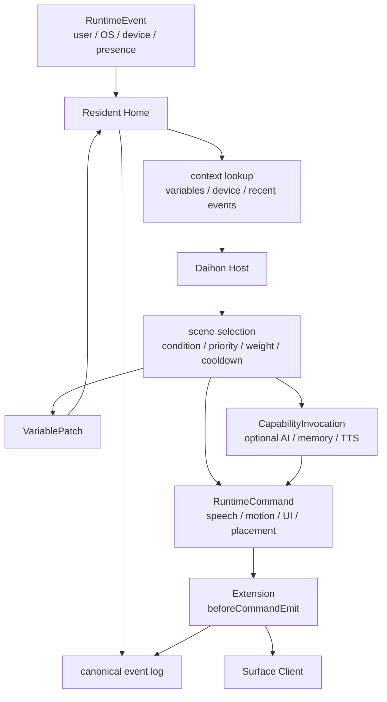

# World Pack and Daihon

World Packは、Yuukeiの世界観を差し替える単位である。キャラクター、見た目、口調、台本、UI生活空間の解釈、許可するsignal、必要capabilityをまとめる。

Daihonは、作者が意図した決定的な生活イベントを実行する層である。AIはDaihonの代替ではなく、Daihonが定義した世界の余白を埋めるcapabilityである。

## World Pack Responsibilities

World Packが持つもの:

- resident/cast定義。
- renderer向けasset参照。
- 台本。
- hit zoneやgesture定義。
- signal allowlist。
- Daihon function binding。
- required/optional capability宣言。
- OS UIをどう生活空間として解釈するか。
- Pack固有のSurface演出やUI断片。
- 初期変数とWorld Pack作者が意図したデフォルト。

World Packが持たないもの:

- OS APIの直接呼び出し。
- LLMやTTSの実装。
- 長期記憶DBの内部形式。
- Surface rendererの実装。
- Resident Homeの状態所有権。

## User World Pack Loading

ユーザーが用意したWorld Packは、アプリデータへコピーするのではなく外部ディレクトリとして参照する。設定画面で選ばれたディレクトリはDevice Hostのローカル設定に保存し、次回起動でも同じPackを試す。

最小ライフサイクル:

1. Device Hostがディレクトリ選択UIを出す。
2. 選択されたrootが `pack.json` を持つWorld Packか検証する。
3. Daihon scriptなどPack内参照はcanonical pathで解決し、Pack root外へ出る参照を拒否する。
4. `capabilities.required` が現在登録されているExtension capabilityで満たせるか確認する。
5. 成功したPack installごとにresidentIdとevent logを分ける。
6. Resident HomeをそのPack installで起動し、`world_pack.activated` を生活史へ記録する。

保存済みPackが削除、移動、破損していた場合、Device HostはDefault World Packで起動して設定画面に失敗理由を表示する。保存済み選択は勝手に消さない。ユーザーが修復するか別Packを選べるようにする。

Daihonのload、検証、起動中のdispatchで発生した診断は、現在のアプリセッション中だけWorld Pack設定画面から確認できるようにする。診断は時系列順に4件まで表示し、5件以上ある場合は折りたたみ表示にして、ユーザーが開いたときにloadと起動中に起きた診断をすべて見られるようにする。次回起動まで引き継ぐ必要はないが、Device Hostにアプリ動作ログがある場合は構造化payloadとして記録する。

## Renderer Assets

World Packは、actorごとにSurface Client向けのrenderer asset参照を宣言できる。参照はPack rootからの相対pathだけを許可する。絶対path、`..`、symlinkでPack root外へ抜ける参照はDevice Hostがload時に拒否する。

最小のVRM actor宣言:

```json
{
  "id": "yuukei",
  "displayName": "Yuukei",
  "speakerAliases": ["ゆ"],
  "renderer": {
    "kind": "vrm",
    "model": "character/character_1.vrm",
    "motions": {
      "walk": "motion/walk.vrma"
    }
  }
}
```

`speakerAliases` はDaihon作者向けの安定した短縮話者名である。`displayName` はUI表示やローカライズのための名前なので、台本上の参照名として暗黙利用しない。Pack load時には、actor IDと `speakerAliases` の重複、空文字、actor IDとの衝突を拒否する。

VRM Surface向けには、renderer定義へ任意で意味付き `hitZones` を追加できる。Pack作者が書かなかった場合、Surface ClientはVRM humanoid boneから `head`、`leftHand`、`rightHand`、`body` などの基本領域を自動生成する。Pack定義は、尻尾、羽、帽子、アクセサリ、触られたくない場所など、VRM標準だけでは分からない意味領域を補完または上書きするためのデータであり、VRMファイル自体は改変しない。

最小のhitZone宣言:

```json
{
  "id": "tail",
  "label": "しっぽ",
  "source": "nodeName",
  "nodes": ["Tail", "Tail_001"],
  "shape": "mesh",
  "events": ["avatar.gesture.poke"],
  "priority": 50
}
```

Surface ClientはPack rootを探索しない。Device Hostが検証済みasset catalogを公開protocol URLへ変換して渡し、Surface ClientはそのURLを描画に使う。DaihonやRuntimeCommandは `avatar.motion` のようなcommandを出すだけで、renderer file pathを直接扱わない。

## Daihon Responsibilities

Daihonは、条件、優先度、重み、クールダウン、変数更新、発話、動作、UI演出を扱う。

Daihonに向いているもの:

- 初回起動。
- 初回移動。
- 初回スマホ移動。
- 初回Downloads遭遇。
- 自分の設定や台本を見られたとき。
- ゴミ箱を空にしたとき。
- スリープ前、復帰後、再起動後。
- 怒り、照れ、拗ねなどの印象的なイベント。
- キャラクター固有の名台詞。
- 作者が制御したい連続イベント。

Daihonは長期記憶エンジンではない。DaihonはResident Homeから渡される変数、event payload、context、runtime query、capability resultを使ってsceneを選び、RuntimeCommandやVariablePatchを返す。

## AI Responsibilities

AIはExtensionが提供するcapabilityとして扱う。

AIに向いているもの:

- ファイル名やフォルダ内容への柔軟な反応。
- 会話の即興返答。
- キャラクター口調への変換。
- 過去ログから得た文脈を自然な一言にすること。
- 台本候補の補助生成。

AI Extensionが直接World Packやevent logを書き換えない。AIの出力はResident HomeがRuntimeCommandやDaihon callbackの結果として扱い、必要ならevent logへ記録する。

## Event Processing Flow

新設計の基本フロー:



処理手順:

1. Device HostまたはSurfaceがRuntimeEventを送る。
2. Resident Homeがeventをcanonical event logへ記録する。
3. HomeがWorld Packのsignal allowlistと権限を確認する。
4. HomeがDaihonへ必要なcontextを渡す。
5. Daihonが条件を満たすsceneを候補化する。
6. 優先度、重み、クールダウンでsceneを選ぶ。
7. sceneがRuntimeCommand、VariablePatch、CapabilityInvocationを生む。
8. Capability resultが必要なら発話やUI演出に変換される。
9. `beforeCommandEmit` hookがあれば、Resident HomeがRuntimeCommandを公開protocol上で変換させる。
10. hook結果と変換後RuntimeCommandがevent logへ記録される。
11. RuntimeCommandがSurfaceへ流れる。

## Runtime Queries

Daihonは、OSや端末の巨大な観測データを直接持たない。必要な情報はruntime queryとしてResident Homeへ問い合わせる。

例:

- 現在の場所。
- 見えているファイル名。
- 選択中の項目数。
- 端末のidle状態。
- active surface。
- 直近の生活イベント。
- Memory Extensionが返した短い文脈。

query結果はDaihonが扱いやすい形に正規化する。巨大なリストや非公開情報を無制限に渡さない。

## Capability Binding

World Packは「この場面でこの能力が必要」という宣言だけを持つ。

例:

- 自由会話には `dialogue.generate` が必要。
- 発話音声には `speech.synthesis` が使える。
- 過去の生活史を参照したい場面では `memory.retrieve` が使える。

Extensionの選択、権限、実行場所、timeout、fallbackはResident Homeが管理する。World Packは特定Extension名に強く依存しない。

## Authoring Principle

World Pack作者は、AIに全部を任せるのではなく、その住人の「らしさ」が出る確定イベントをDaihonで書く。AI ExtensionやMemory Extensionは、その住人が日常の細部に自然に反応するための補助である。

標準signalのDaihon向け日本語名はYuukeiが提供する。Pack作者は `端末_復帰` や `会話_入力` のような標準別名をそのまま使い、標準signalの別名辞書をPackごとに再定義しない。Pack固有の出来事を追加する場合だけ、Pack内のsignal allowlistとDaihon台本で独自名を定義する。

`signals.allow` はcanonical IDを基本にするが、Yuukei標準別名を書いてもload時にcanonical IDへ解決される。有効Extensionがmanifestで寄贈したaliasもWorld/Daihon境界でcanonical IDへ解決できる。未導入または無効なExtension由来aliasは未解決のまま残り、そのトリガーが発火しないだけにする。event logやExtensionへ流れるmessage typeは常にcanonical IDである。

掛け合いを書くときは、World Packのactor定義に `speakerAliases` を置ける。Daihonの `話者: ゆ` や `パ: 「...」` は、YuukeiのWorld/Daihon境界でそれぞれcanonical actor IDへ解決される。Daihon core自体はactor定義を知らず、話者文字列を保持するだけにする。Surface、event log、TTSなどへ流れる `target.actorId` と `payload.speakerId` は常にcanonical actor IDである。
