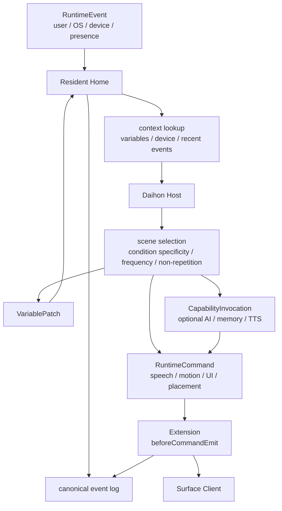

# World Pack and Daihon

World Packは、Yuukeiの世界観を差し替える単位である。キャラクター、見た目、口調、台本、UI生活空間の解釈、許可するsignal、必要capabilityをまとめる。

Daihonは、作者が意図した決定的な生活イベントを実行する層である。AIはDaihonの代替ではなく、Daihonが定義した世界の余白を埋めるcapabilityである。

## World Pack Responsibilities

World Packが持つもの:

- resident/cast定義。
- renderer向けasset参照。
- 台本。
- hit zoneやgesture定義。
- signal allowlist。
- Daihon function binding。
- required/optional capability宣言。
- OS UIをどう生活空間として解釈するか。
- Pack固有のSurface演出やUI断片。
- 初期変数とWorld Pack作者が意図したデフォルト。

World Packが持たないもの:

- OS APIの直接呼び出し。
- LLMやTTSの実装。
- 長期記憶DBの内部形式。
- Surface rendererの実装。
- Resident Homeの状態所有権。

## User World Pack Loading

ユーザーが用意したWorld Packは、アプリデータへコピーするのではなく外部ディレクトリとして参照する。設定画面で選ばれたディレクトリはDevice Hostのローカル設定に保存し、次回起動でも同じPackを試す。

最小ライフサイクル:

1. Device Hostがディレクトリ選択UIを出す。
2. 選択されたrootが `pack.json` を持つWorld Packか検証する。
3. Daihon scriptなどPack内参照はcanonical pathで解決し、Pack root外へ出る参照を拒否する。
4. `capabilities.required` が現在登録されているExtension capabilityで満たせるか確認する。
5. 成功したPack installごとにresidentIdとevent logを分ける。
6. Resident HomeをそのPack installで起動し、`world_pack.activated` を生活史へ記録する。

zipで配布されたWorld Packは、設定画面からインポートできる。zipは検証(pack.jsonの存在と妥当性、パス逸脱の拒否、サイズ上限)を通ったものだけを `YUUKEI_DATA_DIR/packs-imported/<packId>/` へ展開し、以後は通常の外部ディレクトリ参照として扱う。インポート前に、zip内の `LICENSE` / `README.md` と pack.json の任意フィールド `license` から配布条件テキストを探して表示し、見つからない場合もその旨を明示する。

保存済みPackが削除、移動、破損していた場合、Device HostはDefault World Packで起動して設定画面に失敗理由を表示する。保存済み選択は勝手に消さない。ユーザーが修復するか別Packを選べるようにする。

Default World Pack自体が削除、移動、破損しておりフォールバック先がない場合、Device HostはResident HomeやSurfaceを不完全な状態で起動しない。Tauriプロセスをpanicさせず、専用の起動エラー画面にDefault World Packのrootと実際の読込エラーを表示し、ユーザーが修復して再起動できるようにする。

Daihonのload、検証、起動中のdispatchで発生した診断は、現在のアプリセッション中だけWorld Pack設定画面から確認できるようにする。診断は時系列順に4件まで表示し、5件以上ある場合は折りたたみ表示にして、ユーザーが開いたときにloadと起動中に起きた診断をすべて見られるようにする。次回起動まで引き継ぐ必要はないが、Device Hostにアプリ動作ログがある場合は構造化payloadとして記録する。

## Renderer Assets

World Packは、actorごとにSurface Client向けのrenderer asset参照を宣言できる。参照はPack rootからの相対pathだけを許可する。絶対path、`..`、symlinkでPack root外へ抜ける参照はDevice Hostがload時に拒否する。

最小のVRM actor宣言:

```json
{
  "id": "yuukei",
  "displayName": "Yuukei",
  "initialPresence": "present",
  "initialLocation": "desktop",
  "speakerAliases": ["ゆ"],
  "renderer": {
    "kind": "vrm",
    "model": "character/character_1.vrm",
    "motions": {
      "walk": "motion/walk.vrma"
    }
  }
}
```

`initialPresence` (`present` / `away`) と `initialLocation` は、event logにそのactorの状態履歴がまだない初回起動時だけ使う初期状態である。省略時はそれぞれ `present` と `desktop` になる。`initialLocation` の空文字はPack load時に拒否され、未知の `initialPresence` もmanifest errorになる。再起動時に `actor.location.set`、`actor.exit`、`actor.enter` の履歴があれば、履歴から復元した状態がPackの初期値より優先される。複数actorを宣言したまま一人だけでGolden体験を始めたい場合は、後から登場させるactorを `"initialPresence": "away"` にできる。

`speakerAliases` はDaihon作者向けの安定した短縮話者名である。`displayName` はUI表示やローカライズのための名前なので、台本上の参照名として暗黙利用しない。Pack load時には、actor IDと `speakerAliases` の重複、空文字、actor IDとの衝突を拒否する。

VRM Surface向けには、renderer定義へ任意で意味付き `hitZones` を追加できる。Pack作者が書かなかった場合、Surface Clientはスキンウェイト(各頂点がどのhumanoid boneに追従するか)にもとづいてメッシュ表面を標準部位へ自動分類する。標準部位IDは `head`(頭)、`chest`(胸)、`belly`(おなか)、`hips`(腰)、`leftArm`/`rightArm`(腕)、`leftHand`/`rightHand`(手)、`leftThigh`/`rightThigh`(もも)、`leftLeg`/`rightLeg`(すね)、`leftFoot`/`rightFoot`(足)である。Pack定義は、尻尾、羽、帽子、アクセサリ、触られたくない場所など、VRM標準だけでは分からない意味領域を補完または上書きするためのデータであり、VRMファイル自体は改変しない。

最小のhitZone宣言:

```json
{
  "id": "tail",
  "label": "しっぽ",
  "source": "nodeName",
  "nodes": ["Tail", "Tail_001"],
  "shape": "mesh",
  "events": ["avatar.gesture.poke"],
  "priority": 50
}
```

つつく・なでるのジェスチャーが起きると、`＠クリック` などで発火するsceneには `入力#actorId`(触られた住人のID)、`入力#hitZoneId`(部位ID)、`入力#hitZoneLabel`(部位の表示名)が渡される。Surface Clientが表面材質を分類できる場合は `入力#hitSurface`(触れた表面。`skin`/`cloth`/`hair`/`face`)も渡され、「服を引っぱられた」「髪に触られた」のような反応を部位とは別軸の条件として書ける。Daihon作者は `条件:（入力#hitZoneId = 「head」 かつ 入力#actorId = 「yuukei」）` のように、部位と住人ごとの反応を通常の条件として書ける。

Surface ClientはPack rootを探索しない。Device Hostが検証済みasset catalogを公開protocol URLへ変換して渡し、Surface ClientはそのURLを描画に使う。DaihonやRuntimeCommandは `avatar.motion` のようなcommandを出すだけで、renderer file pathを直接扱わない。

## Daihon Responsibilities

Daihonは、条件、頻度、具体性にもとづくscene選択、繰り返し回避、変数更新、発話、動作、UI演出を扱う。

Daihonに向いているもの:

- 初回起動。
- 初回移動。
- 初回スマホ移動。
- 初回Downloads遭遇。
- 自分の設定や台本を見られたとき。
- ゴミ箱を空にしたとき。
- スリープ前、復帰後、再起動後。
- 怒り、照れ、拗ねなどの印象的なイベント。
- キャラクター固有の名台詞。
- 作者が制御したい連続イベント。

Daihonは長期記憶エンジンではない。DaihonはResident Homeから渡される変数、event payload、context、runtime query、capability resultを使ってsceneを選び、RuntimeCommandやVariablePatchを返す。

Daihonの `場所`、`退場`、`登場` は、住人の意味上の現在地とSurface上の在席を操作する。`＜場所 「downloads」＞` は現在話者の `location` だけを変更し、表示状態は変えない。`＜退場＞` は現在地を保ったまま `away` にし、`＜退場 行き先=「downloads」＞` は場所変更と退場を一つの `actor.exit` として原子的に行う。後者は `＜場所 「downloads」＞` に続けて `＜退場＞` を実行した場合と同じ最終状態になる。`＜登場＞` は現在地を保って `present` にし、`＜登場 場所=「desktop」＞` は場所変更と登場を一つの `actor.enter` として行う。

場所IDはWorld Pack作者が安定して使う意味語彙であり、OSの実パスではない。`desktop.folder.opened` の `入力#フォルダ` と同じ `downloads`、`pictures` などを使えば、退場中の住人とユーザーが同じフォルダで遭遇するsceneを書ける。複数actorの台本では、これらの関数は現在の `話者` だけを対象にする。

各dispatchには、eventの対象actor、対象指定がなければdefault actorの現在地が `入力#場所`、在席状態が `入力#在席` (`present` / `away`) として渡される。フォルダ遭遇では `条件:（入力#場所 = 入力#フォルダ かつ 入力#在席 = 「away」）` のように判定できる。generic eventでdefault actor以外の現在地を判定したいWorld Packは、actorごとのDaihon変数も併用する。

継続する生活行動には、現在話者を対象とする次の日本語関数を使う。

- `＜活動開始 種類=「window-watching」 段階=「approaching」 関心=「focused-window」 画面外継続=いいえ 中断可能=はい＞`
- `＜活動段階 「observing」 関心=「window-category」＞`
- `＜活動中断 理由=「user-interaction」＞`
- `＜活動再開＞`
- `＜活動終了＞`
- `＜ごまかし画面 題=「設定を読み込めません」 本文=「ここは見られません」 秒数=9＞`

`活動開始` はResident Homeが所有するActorActivityを開始し、`活動段階` は同じ活動の進行を更新する。`活動中断` と `活動再開` は最初の開始時刻を保ったまま一時停止と継続を表し、`活動終了` は現在Activityを消す。これらはmotionの別名ではない。Surfaceを再接続またはアプリを再起動しても、event logから活動を復元できる。

`関心` はWorld Packが決めるprivacy-safeな意味ラベルに限定する。`focused-window`、`latest-image`、`downloaded-audio` のようなカテゴリや役割はよいが、ファイルの実パス、ウィンドウタイトル、文書本文、個人名を含む観測値をそのまま保存してはならない。必要な一時観測はevent payloadまたは権限付きruntime queryからその場で使い、継続Activityへコピーしない。

各dispatchでは現在Activityを `入力#活動`、`入力#活動ID`、`入力#活動段階`、`入力#活動関心`、`入力#活動開始時刻`、`入力#活動中断可能`、`入力#活動中断中`、`入力#活動中断理由`、`入力#活動画面外継続` から参照できる。これにより、Downloadsを開いた瞬間に活動を作るのではなく、発見前から画面外で続いていた活動を条件にして `caught in the act` を書ける。

`入力#活動開始時刻` はtimezone offsetを含むRFC 3339の絶対時刻であり、中断・再開や端末timezoneの変更で書き換えない。朝、深夜など端末側の生活時間でActivityを分岐するときは、保存済み開始時刻から時だけを抜き出さず、現在eventの `入力#現在時` / `入力#現在分` またはDaihonの組み込み時刻条件を使う。Device Hostが送る `localHour` / `localMinute` はDaihon dispatch時のローカル時刻を決めるための値で、ActorActivityの永続状態にはコピーしない。

`ごまかし画面` はYuukei自身の設定Surfaceだけに出せる安全なエラー風overlayを作る。`題` と `本文` は必須のplain text、`秒数` は任意である。任意HTML、URL、ファイルpath、外部windowの指定はDaihon関数に存在しない。ユーザーが閉じるか期限が来ると `ごまかし画面_閉じた` が対象actorへ返るため、台本は驚く、隠す、見つかる、片づけるというActivityの段階を発話なしで接続できる。

Daihonのscene選択履歴は、World Pack installごとのアプリデータとして保存する。`頻度: 一度きり` や `頻度: 1日に1回`、直近の繰り返し回避に使う履歴は再起動後も引き継がれるが、別のWorld Packへ切り替えた場合は混ざらない。

`全体#`、`住人#actor#`、`関係#a#b#` スコープの変数も同様にWorld Pack installごとのアプリデータとして保存され、再起動後も引き継がれる。`初期値:` は保存値が存在しないkeyにだけ適用され、保存値と `初期値:` の型が食い違う場合は保存値を破棄して初期値を採用する。イベント内変数、`_一時`、`入力#` は保存されない。

## AI Responsibilities

AIはExtensionが提供するcapabilityとして扱う。

AIに向いているもの:

- ファイル名やフォルダ内容への柔軟な反応。
- 会話の即興返答。
- キャラクター口調への変換。
- 過去ログから得た文脈を自然な一言にすること。
- 台本候補の補助生成。

AI Extensionが直接World Packやevent logを書き換えない。AIの出力はResident HomeがRuntimeCommandやDaihon callbackの結果として扱い、必要ならevent logへ記録する。

## Event Processing Flow

基本フロー:


```mermaid
flowchart TB
  Event["RuntimeEvent\nuser / OS / device / presence"] --> Home["Resident Home"]
  Home --> Log["canonical event log"]
  Home --> Context["context lookup\nvariables / device / recent events"]
  Context --> Daihon["Daihon Host"]
  Daihon --> Candidate["scene selection\ncondition specificity / frequency / non-repetition"]
  Candidate --> Command["RuntimeCommand\nspeech / motion / UI / placement"]
  Candidate --> Patch["VariablePatch"]
  Candidate --> Cap["CapabilityInvocation\noptional AI / memory / TTS"]
  Cap --> Command
  Command --> Hook["Extension\nbeforeCommandEmit"]
  Hook --> Surface["Surface Client"]
  Patch --> Home
  Hook --> Log
```

処理手順:

1. Device HostまたはSurfaceがRuntimeEventを送る。
2. Resident Homeがeventをcanonical event logへ記録する。
3. HomeがWorld Packのsignal allowlistと権限を確認する。
4. HomeがDaihonへ必要なcontextを渡す。
5. Daihonが条件を満たすsceneを候補化する。
6. 頻度制限中のsceneを除き、条件が一番具体的なsceneを残し、直前の繰り返しを避けて一様抽選する。
7. sceneがRuntimeCommand、VariablePatch、CapabilityInvocationを生む。
8. Capability resultが必要なら発話やUI演出に変換される。
9. `beforeCommandEmit` hookがあれば、Resident HomeがRuntimeCommandを公開protocol上で変換させる。
10. hook結果と変換後RuntimeCommandがevent logへ記録される。
11. RuntimeCommandがSurfaceへ流れる。

## Runtime Queries

Daihonは、OSや端末の巨大な観測データを直接持たない。必要な情報はruntime queryとしてResident Homeへ問い合わせる。

例:

- 現在の場所。
- 見えているファイル名。
- 選択中の項目数。
- 端末のidle状態。
- active surface。
- 直近の生活イベント。
- Memory Extensionが返した短い文脈。

query結果はDaihonが扱いやすい形に正規化する。巨大なリストや非公開情報を無制限に渡さない。

## Capability Binding

World Packは「この場面でこの能力が必要」という宣言だけを持つ。

例:

- Daihonが指示したセリフ補完には `dialogue.generate` が使える。
- 発話音声には `speech.synthesis` が使える。
- 過去の生活史を参照したい場面では `memory.retrieve` が使える。

Extensionの選択、権限、実行場所、timeout、fallbackはResident Homeが管理する。World Packは特定Extension名に強く依存しない。

World Pack作者が、Daihon不一致時だけAIへ環境起点の余白を委任したい場合は `llmDelegation` でcanonical signalを明示する。未宣言のsignalは委任されず、`llmDelegation` のないPackはDaihon不一致時に沈黙する。v1ではユーザー発話を汎用会話へフォールバックさせない。`dialogue.generate` はDaihonが生成指示を所有する場合に限り使い、常設チャットの代替にしない。

```json
{
  "llmDelegation": {
    "signals": [
      { "signal": "presence.talk_impulse", "cooldownSeconds": 300 }
    ],
    "dailyBudget": 50
  }
}
```

`cooldownSeconds` と `dailyBudget` は省略でき、省略時はそれぞれクールダウンなし・無制限である。cooldownと日次予算の実施はResident Homeが行い、カウンタは現在のプロセス内状態として扱う。

cooldown中に届いたeventの委任は、エラーやフィードバックなしに沈黙で見送られる。cooldownは `presence.talk_impulse` のような環境起点のsignalの頻度制御に使う。ユーザー入力はDaihonが開始した場面の待受として処理し、汎用的な不一致委任の対象にはしない。

すべてのDaihon dispatchには `入力#AI接続`(真偽値)が渡される。`dialogue.generate` のcapability routeが登録されていれば「はい」、いなければ「いいえ」になる。Pack作者はAIを使う場面にも固定のフォールバックセリフを用意し、AIなし・失敗時にもDaihonが場面を完結できるようにする。

Daihon scene内でユーザー入力などの曖昧な値を分岐用の構造化値にしたい場合は、式関数 `解釈` を使える。構文は `判定=＜解釈 (入力#ユーザー発言) 「何を判定するか」 「はい/いいえ」＞` のように、解釈対象、質問、区切り文字つき選択肢を3引数で渡す。選択肢は `/`、`／`、`|`、`、`、`,` で区切れる。結果は選択肢の文字列または `不明` であり、AIは文章を生成しない。

`解釈` の結果を代入したsceneは、同じscene内の後続条件分岐でその変数を使い、`※それ以外:` または `※（判定 = 「不明」）なら:` の枝を持つ必要がある。provider未登録、timeout、エラー、選択肢外の応答はいずれも `不明` としてDaihonへ戻る。

`解釈` のcapability呼び出しがin-flightの間、Resident Homeは `conversation.` で始まる後続eventをメモリ内FIFOキューへ積む。上限は16件で、超過時は最古を破棄して記録する。会話系以外のeventはcanonical event logへ記録だけ行い、そのdispatchと余白フォールバックは行わない。

Daihon scene内でユーザー入力から選択肢に縛られない値を取り出したい場合は、式関数 `抽出` を使える。構文は `_呼び名 = ＜抽出 (入力#発言) 「ユーザーの呼び名」＞` のように、抽出対象と指示を2引数で渡す。結果は100文字までの文字列または `不明` であり、AIは文章を生成しない。`dialogue.extract` capabilityを呼び、provider未登録、timeout、エラー、空応答、100文字超はいずれも `不明` として戻る。in-flight中のeventポリシーと呼び出し回数上限(dispatchあたり `解釈` と合計4回)は `解釈` と共有する。取り出した値を `全体#` などの保存されるスコープへ代入すれば、住人は会話から知った事実を覚え続けられる。

Daihon scene内でセリフ1行の文面だけをAIに埋めたい場合は、文関数 `生成` を使える。構文は `＜生成 「お出かけの日の楽しみを一言」＞` または `＜生成 「お出かけの日の楽しみを一言」 「楽しみだなあ」＞` のように、第1引数へ生成指示、第2引数へ任意のフォールバックセリフを渡す。入力値や保存変数を指示へ含める場合は `＜生成 (「前面アプリは 」 + 入力#アプリ + 「。短く描写する」) 「窓の気配が変わりました。」＞` のように文字列結合式を使う。フォールバックにも同じ書き方を使える。話者は通常のセリフ行と同じ現在話者である。

`生成` は `dialogue.generate` capabilityを呼び、出力が `speak: true` かつ空でない `text` を持つ場合だけ、そのtextを現在話者の通常セリフとして出す。`expression` や `motion` があれば同じ生成由来コマンドとして併せて出す。provider未登録、timeout、エラー、`speak: false`、空textの場合はフォールバックセリフを出し、フォールバックがなければその行をスキップしてsceneを継続する。

`生成` から出たコマンドはcanonical event logで台本直書きのセリフと区別できるよう、生成由来のsourceと `sourceCapability: "dialogue.generate"`、`sourceFunction: "生成"`、`generationInstruction` を持つ。in-flight中のeventポリシーは `解釈` と同じで、後続の会話系eventはキューされ、会話系以外は記録のみになる。

定期的なひとりごとである `presence.talk_impulse` / `雑談_定期` は、Intelligence Extensionの `mood.evaluate` が有効な場合だけ気分で通過・スキップが調整される。Daihonには常に `入力#気分` と `入力#話題` が渡され、未評価または評価失敗時は `入力#気分 = 「ふつう」`、`入力#話題 = 「」` になる。World Pack作者は `条件:（入力#気分 = 「さみしい」）` のように、気分に応じた雑談sceneを通常のDaihon条件として書ける。

## Authoring Principle

World Pack作者は、AIに全部を任せるのではなく、その住人の「らしさ」が出る確定イベントをDaihonで書く。AI ExtensionやMemory Extensionは、その住人が日常の細部に自然に反応するための補助である。

生活機能の公開語彙は **体験 → 反復 → 抽象化** の順で育てる。まず既定住人の具体的な一場面を最後まで成立させ、同じ仕組みを異なる二つ以上の場面で反復し、実際に共通だった制御だけをDaihon関数やWorld Pack schemaへ昇格する。想像上の汎用性のために、固有の芝居を単発motionと発話へ薄めない。一方、一場面だけの固有値をCoreの標準語彙へ持ち上げない。

標準signalのDaihon向け日本語名はYuukeiが提供する。Pack作者は `端末_復帰` や `会話_入力` のような標準別名をそのまま使い、標準signalの別名辞書をPackごとに再定義しない。Pack固有の出来事を追加する場合だけ、Pack内のsignal allowlistとDaihon台本で独自名を定義する。

`signals.allow` はcanonical IDを基本にするが、Yuukei標準別名を書いてもload時にcanonical IDへ解決される。有効Extensionがmanifestで寄贈したaliasもWorld/Daihon境界でcanonical IDへ解決できる。未導入または無効なExtension由来aliasは未解決のまま残り、そのトリガーが発火しないだけにする。event logやExtensionへ流れるmessage typeは常にcanonical IDである。

掛け合いを書くときは、World Packのactor定義に `speakerAliases` を置ける。Daihonの `話者: ゆ` や `パ: 「...」` は、YuukeiのWorld/Daihon境界でそれぞれcanonical actor IDへ解決される。Daihon core自体はactor定義を知らず、話者文字列を保持するだけにする。Surface、event log、TTSなどへ流れる `target.actorId` と `payload.speakerId` は常にcanonical actor IDである。
